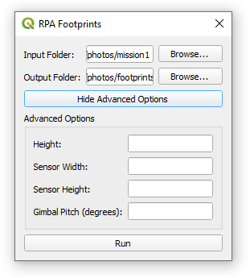

# rpa_footprints

#### Simple QGIS plugin to generate footprint polygons from drone images.

This plugin allows you to input a folder of drone images collected with a drone or Remotely Piloted Aircraft (RPA) and estimate the approximate footprint area of each image based their metadata. A footprint is essentially a polygon representing the approximate area sampled by an image on the ground. The Phil Harvey ExifTool is used in this plugin to extract EXIF tags with metadata for each image: https://github.com/exiftool/exiftool. 

Caveats:
- Currently only working for DJI drones, but sensor dimensions have not be added for all sensors. You can manually specify sensor dimensions in the advanced options though.
- This plugin assumes a flat earth, meaning footprints won't be accurate if they are collected on non-flat terrain. The more sophisticated repo from spifftek70 allows you to warp footprints with a terrain model for images on undulating terrain and also georeference individual images: https://github.com/spifftek70/Drone-Footprints

---

## Installation

To install the plugin, download the .zip file of the repo and install it through the QGIS plugin manager. It has several depencies which should be installed when the plugin is loaded for the first time. A copy of the Phil Harvey ExifTool is included within the plugin to handle image metadata extraction.

Once installed, it should show up in the plugins and be visible in the toolbar with the symbol:

---

## Usage

### Generate footprints for a folder

The plugin requires you to select and input folder containing all the images, and an output folder where the footprints will be exported to. There are advanced options if you want to manually enter your own parameters. These parameters are applied to EVERY image in the input folder if you use them.

Advanced options:
- Height (m): Height in metres of drone images above the ground level
- Sensor Width (mm): Width of the sensor in millimetres
- Sensow Height (mm): Height of the sensor in millimetres
- Gimbal Pitch (degrees): Pitch of the gimbal. Must be between 0 and -90 degrees. A pitch of -90 degrees meanings the sensor is pointing directly downwards (nadir)

The footprints are exported to geojson files in the output folder, with each footprint having a number of attributes taken from the image metadata.

### Visualise 

The plugin allows you to play around with the different parameters that influence the footprint shapes, and updates it in real time with 2D and 3D plots. This is a good way to visually grasp how the area sampled by a drone image differs based upon the drone location, gimbal orientation and sensor specifications.

---

### How it works

The code is based off a forum post by "Houska" which was then translated into a python script https://gis.stackexchange.com/questions/384756/georeference-single-drone-image-from-exif-data. You can read the code yourself in the footprints.py file, in particular the "img_footprint_coords" function which generates the footprint corner coordinates based upon the required drone and sensor metadata: https://github.com/Geospaziale/rpa_footprints/blob/main/rpa_footprints/footprints.py. It is essentially a bunch of trigonometry that takes into account the location of the drone, height (above ground level), gimbal pitch, gimbal yaw, focal length, sensor dimensions and image dimensions.

There is also an existing Python repositry for generating footprints and georeferencing invidivual images which is more robust than this but isn't surfaced as a QGIS tool as of yet: https://github.com/spifftek70/Drone-Footprints.